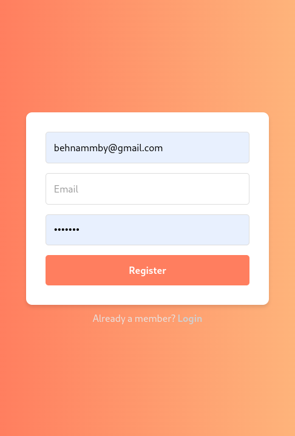

# Todo List Application

https://github.com/user-attachments/assets/b2bc3302-256e-4510-8614-28268a8b226e

## Overview
This is a full-stack Todo List Application developed using modern web technologies. The application provides users with an intuitive interface to manage their tasks efficiently. It includes authentication, CRUD functionality for todos, and various user-friendly features such as inline editing, sorting, and responsive design.

## Features
- **Authentication**: Users can register and log in securely.
- **Task Management**:
  - Add new tasks quickly by typing the title and pressing enter.
  - Inline editing of task descriptions.
  - Mark tasks as completed using a checkbox.
  - Sort tasks by their due dates.
- **Responsive Design**: Optimized for various screen sizes.
- **State Management**: Implemented using React Context API.
- **Styling**: Utilizes TailwindCSS for a clean and modern look.
- **Notifications**: Displays user-friendly toasts for task actions (e.g., added, updated, deleted).

## Technologies Used
- **Frontend**: React (via Vite) with TypeScript.
- **State Management**: React Context API.
- **Styling**: TailwindCSS.
- **Notifications**: React Toastify.
- **Package Manager**: Bun.
- **Testing**: Vitest.
- **Backend**: A companion project handles authentication and CRUD operations.

## Prerequisites
- Node.js and Bun installed on your system.
- Backend service running and accessible.

## Setup and Installation

### Clone the Repository
```bash
# Clone the frontend repository
git clone <repository_url>
cd <repository_folder>
```

### Install Dependencies
Ensure you have `bun` installed. Then run:
```bash
bun install
```

### Configure Environment Variables
Create a `.env` file in the root directory and add the following variables:
```env
VITE_BACKEND_URL=<backend_base_url>
```
Replace `<backend_base_url>` with the URL of the backend server.

### Run the Application
To start the development server, run:
```bash
bun run dev
```
The application will be available at `http://localhost:5173`.

### Build for Production
To build the application for production, run:
```bash
bun run build
```
The built files will be in the `dist` folder.

### Preview the Production Build
To preview the production build locally, run:
```bash
bun run preview
```

## Backend Integration
Ensure the backend server is running and accessible. The application communicates with the backend for authentication and CRUD operations.

## Testing
The application uses Vitest for testing. To run the tests:
```bash
bun run test:browser
```

## Project Structure
```
frontend/
├── src/
│   ├── components/      # React components
│   ├── context/         # Context API setup
│   ├── pages/           # Page components (e.g., Login, Register, Todos)
│   ├── services/        # API integration codes
│   ├── types/           # Shared types across the app
│   ├── App.tsx         # Root component
│   └── main.tsx        # Application entry point
├── public/         # Static assets
├── .env            # Environment variables
└── package.json    # Project configuration
```

## Future Improvements
- **Advanced Filtering**: Filter tasks by status (completed/incomplete).
- **Dark Mode**: Add a toggle for light/dark mode.
- **Reminders**: Notify users of tasks nearing their due date.

## Conclusion
This Todo List Application offers a robust foundation for managing tasks with a user-friendly interface and modern web technologies. Contributions and suggestions for improvement are welcome!

## Screenshots




